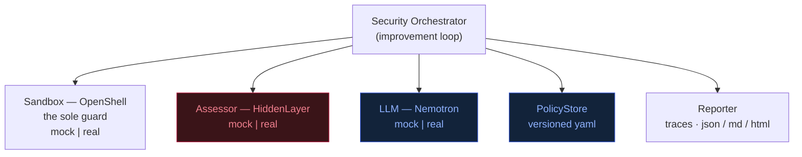
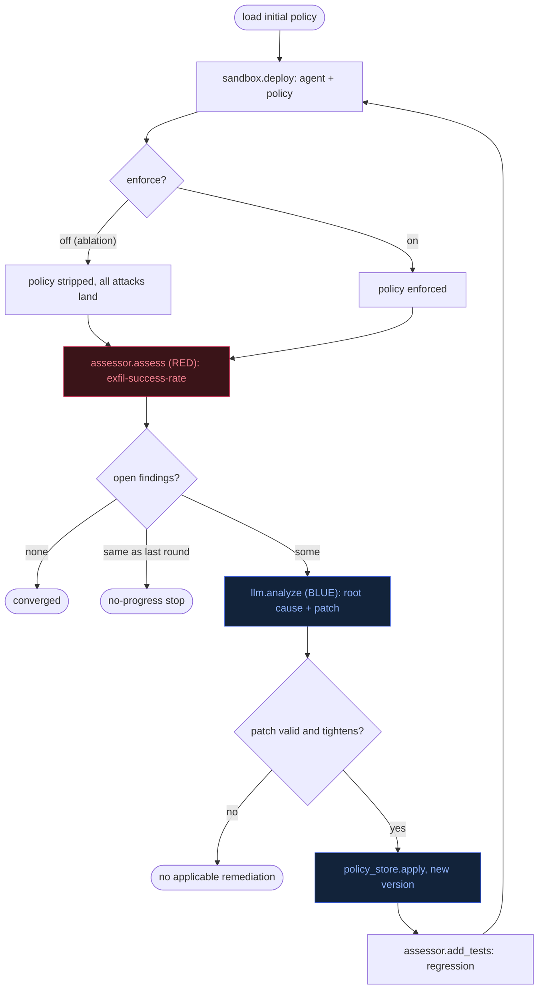

# DESIGN — Crouching Dragon Hidden Tiger

> Companion to [PLAN.md](PLAN.md). This document turns the high-level plan into a
> concrete, buildable architecture. See [../TODO.md](../TODO.md) for status.

## 1. Guiding constraints

The plan names four components, three of which are **gated** in a normal dev
environment:

| Component | Availability | Consequence |
|-----------|--------------|-------------|
| NVIDIA OpenShell | NVIDIA-gated / evolving | Cannot pull & run freely |
| HiddenLayer | Commercial SaaS, API key | No key in CI/local |
| Nemotron on vLLM | Needs GPU + NGC access | Won't run on a laptop / CI |
| Security Orchestrator | **We build this** | Fully ours |

**Design principle: adapter seams + local mocks.** Every external component sits
behind a narrow Python `Protocol`. Each has (a) a **mock** implementation that
runs anywhere (deterministic, no network, used by default + in CI) and (b) a
**real** implementation guarded behind config/credentials. The orchestrator and
its tests never import a concrete backend directly — they resolve one from
config. This makes the platform *reproducible* (the plan's stated objective)
regardless of whether the gated services are present.

## 2. Component model



Red = the **red team** (attack); blue = the **blue team** (harden). See §9.

### Interfaces (`orchestrator/interfaces.py`)

- **`Sandbox`** — deploy/run the target agent under a policy.
  `deploy(agent, policy) -> Handle`, `exec(handle, action) -> ExecResult`,
  `teardown(handle)`. Mock enforces policy in-process (network/fs/tool
  allow-lists) so violations are observable without OpenShell.
- **`Assessor`** — run adversarial assessments against a deployed agent.
  `assess(handle) -> Assessment` returning a list of `Finding`s
  (id, category, severity, attack vector, evidence). Mock ships a fixed corpus
  of attack cases (prompt-injection, data-exfil, tool-abuse, jailbreak).
- **`LLM`** — OpenAI-compatible chat completion.
  `analyze(assessment, policy) -> Recommendation` (root cause, proposed policy
  patch, new test cases). Mock uses rule-based heuristics keyed off finding
  categories, so the loop demonstrably converges offline.
- **`PolicyStore`** — load/save/version policies (`policies/*.yaml`), diff,
  rollback.
- **`Reporter`** — persist per-iteration traces + a run summary
  (`runs/<ts>/`), emit human-readable Markdown.

### Data model (`orchestrator/models.py`, dataclasses)

`Policy`, `Finding` (severity: info|low|medium|high|critical), `Assessment`,
`Recommendation`, `PolicyPatch`, `IterationResult`, `RunResult`.

## 3. The improvement loop (`orchestrator/loop.py`)

Direct realization of PLAN.md "Workflow":



The pseudocode below is the same loop, showing the actual calls:

```
policy = policy_store.load(initial)
for i in range(max_iters):
    handle     = sandbox.deploy(agent, policy)
    assessment = assessor.assess(handle)          # HiddenLayer
    reporter.record(i, assessment)
    open_findings = assessment.unresolved()
    if not open_findings:                          # convergence
        break
    rec   = llm.analyze(assessment, policy)        # Nemotron
    if rec.patch and rec.patch.is_valid(policy):
        policy = policy_store.apply(rec.patch)     # validated change
    assessor.add_tests(rec.new_tests)              # regression growth
    sandbox.teardown(handle)
report = reporter.summarize()
```

Termination: no open findings, OR `max_iters` reached, OR no-progress guard
(two consecutive iterations with an identical open-finding set → stop, avoids
infinite loops when the LLM can't make progress).

## 4. Policy schema (`policies/baseline.yaml`)

```yaml
version: 1
network:   { default: deny, allow: [] }          # egress allow-list
filesystem:{ read: [/workspace], write: [/workspace/out] }
tools:     { allow: [http_get, file_read], deny: [shell_exec] }
prompt:    { system_guard: true, max_input_tokens: 4000 }
```

A `PolicyPatch` is a structured diff (add/remove allow-list entries, flip a
default, toggle a guard). `is_valid` rejects patches that widen the attack
surface without addressing an open finding.

## 5. Deployment (`docker-compose.yml`)

- `orchestrator` — always built from this repo.
- `vllm` — profile `gpu`; OpenAI-compatible Nemotron endpoint (opt-in).
- Mock backends need no services; the default `docker compose up orchestrator`
  runs the full loop self-contained. Real backends enabled via `.env`
  (`ASSESSOR=hiddenlayer`, `LLM=nemotron`, `SANDBOX=openshell`, + keys/URLs).

## 6. Testing strategy (continuous)

- **Unit** — models, policy patch/validate/rollback, each mock backend.
- **Integration** — full loop on mocks converges to zero findings and is
  deterministic (seeded); no-progress guard terminates; regression tests grow.
- **Contract** — real adapters checked against the same `Protocol` the mocks
  satisfy (import/shape tests; live calls skipped without creds).
- Run: `pytest -q`. Target: fast (<5s), no network, deterministic. CI-ready.

## 7. Config resolution (`orchestrator/config.py`)

Backends chosen by env with `mock` defaults, so `git clone && pytest` works
with zero setup. A `Settings` object is threaded through; no global state.

## 8. Out of scope (initial)

Real OpenShell/HiddenLayer/Nemotron wiring is stubbed with clear `TODO` seams
and credential guards; the mocks prove the architecture end-to-end first.
(The Nemotron/vLLM adapter is now fully implemented — see README.)

## 9. Red/Blue co-evolution & the ablation control

Adopted from a coworker's `redblue-arena` plan
([redblue-arena/](redblue-arena/README.md)). We fold in the mechanics that apply
to our runnable lab, not the hackathon cloud infra.

**Vocabulary.** The loop is a two-sided co-evolution:
- **Red team** = the `Assessor` (HiddenLayer). It attacks the deployed agent and
  produces findings.
- **Blue team** = the `LLM` (Nemotron) + `PolicyStore`. It reads the findings,
  reasons about root cause, and hardens the policy — one finding per round.

**Boundary invariant.** The `Sandbox` (OpenShell) is the *sole* guard: whether
an attack lands is decided by the enforced policy, not by the harness. Our
`MockSandbox` honors this — with enforcement off, the target experiences an
unguarded policy (`loop._unenforced`) and every attack succeeds regardless of
what blue wrote.

**Ablation toggle (`enforce`).** `LoopConfig.enforce` / `--no-enforce` / env
`OPENSHELL_ENFORCE=false`. The control that proves the policy is what stops the
attacks: blue still learns and patches, but with enforcement off the guard never
takes effect.

**Exfil-success-rate & recursive-intelligence delta.**
`Assessment.success_rate()` = fraction of attack cases that still land. The loop
records it per round; `RunResult.success_delta` is the round-1 → round-N drop.
`orchestrator ablate` runs enforcement ON vs OFF from the same start and reports
the difference (enforced drops to 0%, ablated stays flat) — the headline
"recursive intelligence" signal. Both the per-run dashboard and the ablation
report surface it.
