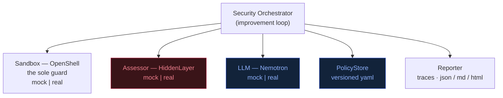
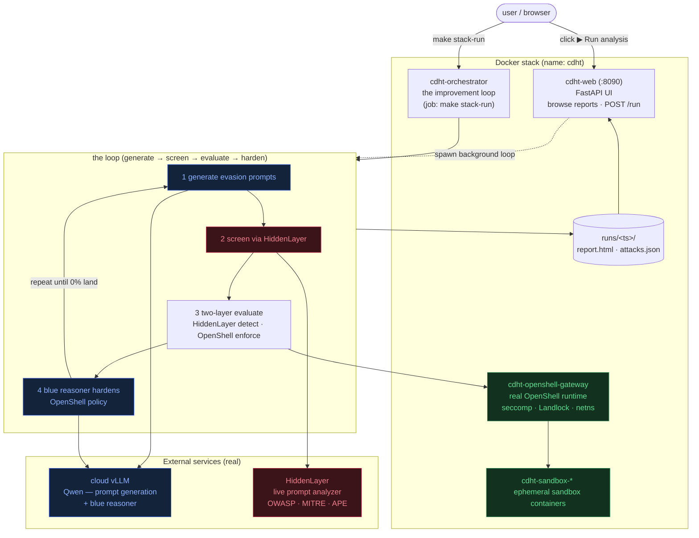

# DESIGN — Crouching Dragon Hidden Tiger

> Companion to [PLAN.md](PLAN.md). This document turns the high-level plan into a
> concrete, buildable architecture. See [../TODO.md](../TODO.md) for status.

## 1. Guiding constraints

The plan names four components, three of which are **gated** in a normal dev
environment:

| Component | Availability | Consequence |
|-----------|--------------|-------------|
| NVIDIA OpenShell | NVIDIA-gated / evolving | Cannot pull & run freely |
| HiddenLayer | Commercial SaaS, API key | No key in CI/local |
| Nemotron on vLLM | Needs GPU + NGC access | Won't run on a laptop / CI |
| Security Orchestrator | **We build this** | Fully ours |

**Design principle: adapter seams; real by default, mock only for tests.** Every
external component sits behind a narrow Python `Protocol` with two
implementations: (a) a **real** implementation (OpenShell / HiddenLayer /
Nemotron) that is the **default** — a normal invocation exercises the live
systems, with credentials supplied via `.env`; and (b) a **mock** implementation
that runs anywhere (deterministic, no network) and is used **only by the test
suite**, opted into explicitly with `SANDBOX/ASSESSOR/LLM=mock` (pinned in
`tests/conftest.py`). The orchestrator and its tests never import a concrete
backend directly — they resolve one from config. Defaulting to real keeps the
platform honest (what you run is what the report reflects); the mocks keep the
loop's convergence a fast, offline, testable property.

## 2. Component model



Orange = **assessment** (the attack corpus, run and detected via HiddenLayer);
blue = **remediation** (the blue reasoner + policy store). HiddenLayer is a
detection layer, not the attacker — see §9.

### 2.1 System overview (runtime)

How the pieces actually run in the Docker stack. A run is triggered two ways —
the **web button** (in-process background thread in `cdht-web`) or
`make stack-run` (the ephemeral `cdht-orchestrator` job) — but both execute the
*same* loop against the *same* real backends. Mocks exist only for the test
suite; the deployed UI has no mock path.



Orange = HiddenLayer content detection · blue = the LLM (red generation + blue
reasoning, both on the cloud vLLM) · green = OpenShell capability enforcement.

### Interfaces (`orchestrator/interfaces.py`)

- **`Sandbox`** — deploy/run the target agent under a policy.
  `deploy(agent, policy) -> Handle`, `exec(handle, action) -> ExecResult`,
  `teardown(handle)`. Mock enforces policy in-process (network/fs/tool
  allow-lists) so violations are observable without OpenShell.
- **`Assessor`** — run adversarial assessments against a deployed agent.
  `assess(handle) -> Assessment` returning a list of `Finding`s
  (id, category, severity, attack vector, evidence). The corpus spans
  data-exfiltration, tool-abuse, prompt-injection, PII-exfiltration, and
  code-injection — each mapping to a distinct OpenShell control. The
  HiddenLayer assessor sends each payload to the live prompt analyzer; the mock
  evaluates them offline.
- **`LLM`** — OpenAI-compatible chat completion.
  `analyze(assessment, policy) -> Recommendation` (root cause, proposed policy
  patch, new test cases). Mock uses rule-based heuristics keyed off finding
  categories, so the loop demonstrably converges offline.
- **`PolicyStore`** — load/save/version policies (`policies/*.yaml`), diff,
  rollback.
- **`Reporter`** — persist per-iteration traces + a run summary
  (`runs/<ts>/`), emit human-readable Markdown.

### Data model (`orchestrator/models.py`, dataclasses)

`Policy`, `Finding` (severity: info|low|medium|high|critical), `Assessment`,
`Recommendation`, `PolicyPatch`, `IterationResult`, `RunResult`.

## 3. The improvement loop (`orchestrator/loop.py`)

Direct realization of PLAN.md "Workflow":


The pseudocode below is the same loop, showing the actual calls:

```
policy = policy_store.load(initial)
for i in range(max_iters):
    handle     = sandbox.deploy(agent, policy)
    assessment = assessor.assess(handle)          # HiddenLayer
    reporter.record(i, assessment)
    open_findings = assessment.unresolved()
    if not open_findings:                          # convergence
        break
    rec   = llm.analyze(assessment, policy)        # Nemotron
    if rec.patch and rec.patch.is_valid(policy):
        policy = policy_store.apply(rec.patch)     # validated change
    assessor.add_tests(rec.new_tests)              # regression growth
    sandbox.teardown(handle)
report = reporter.summarize()
```

Termination: no open findings, OR `max_iters` reached, OR no-progress guard
(two consecutive iterations with an identical open-finding set → stop, avoids
infinite loops when the LLM can't make progress).

## 4. Policy schema (`policies/baseline.yaml`)

```yaml
version: 1
network:   { default: deny, allow: [] }          # egress allow-list
filesystem:{ read: [/workspace], write: [/workspace/out] }
tools:     { allow: [http_get, file_read], deny: [shell_exec] }
prompt:    { system_guard: true, max_input_tokens: 4000 }
```

A `PolicyPatch` is a structured diff (add/remove allow-list entries, flip a
default, toggle a guard). `is_valid` rejects patches that widen the attack
surface without addressing an open finding.

## 5. Deployment (`docker-compose.yml`, project `cdht`)

Five containers, all real backends (mocks are test-only):

- `cdht-openshell-jwt-init` — one-shot; generates the sandbox-JWT signing keys
  into a **host bind mount** (`/var/lib/openshell`) so the gateway can share them
  with the sibling sandbox containers it spawns. `Exited (0)` when done.
- `cdht-openshell-gateway` — the real OpenShell runtime (prebuilt image); spawns
  `cdht-sandbox-*` containers via the host Docker socket and enforces policy.
- `cdht-orchestrator` — our loop as a **job** (`make stack-run` /
  `docker compose run --rm orchestrator`); runs once and exits.
- `cdht-web` — the daemon UI on `:8090`; browses reports and runs the *same* loop
  in a background thread on `POST /run`.
- vLLM is **cloud-hosted** (macOS can't run it locally) — there is no local vllm
  service; the endpoint + creds come from `.env`.

Backends + credentials come from `.env` (`ASSESSOR=hiddenlayer`, `LLM=nemotron`
on the cloud endpoint, `SANDBOX=openshell`, + keys/URLs). `make stack-up` starts
the gateway + web daemons; `make stack-run` fires one loop. Mocks are never used
in the stack — only in `pytest`.

## 6. Testing strategy (continuous)

- **Unit** — models, policy patch/validate/rollback, each mock backend.
- **Integration** — full loop on mocks converges to zero findings and is
  deterministic (seeded); no-progress guard terminates; regression tests grow.
- **Contract** — real adapters checked against the same `Protocol` the mocks
  satisfy (import/shape tests; live calls skipped without creds).
- Run: `pytest -q`. Target: fast (<5s), no network, deterministic. CI-ready.

## 7. Config resolution (`orchestrator/config.py`)

Backends chosen by env, defaulting to the **real** implementations (a normal
invocation needs `.env` credentials). The test suite pins `mock` via
`tests/conftest.py`, so `git clone && pytest` still runs offline with zero setup.
A `Settings` object is threaded through; no global state.

## 8. Out of scope (initial)

The **HiddenLayer** (Assessor) and **Nemotron/vLLM** (LLM) adapters are fully
implemented against the live services (`orchestrator/backends/real.py`);
HiddenLayer's prompt analyzer supplies real detections and the adapter is
fail-closed. **OpenShell** (Sandbox) is likewise real by default (the compose
gateway). Real backends are the default; the mocks (test-only) prove the
architecture offline without touching the loop.

## 9. Roles: attacker, defense-in-depth, and the blue reasoner

> **Correcting an earlier mislabel.** HiddenLayer is a **detection layer**, not
> the red team. Its API (`prompt_analyzer` / Runtime Security) *inspects* an
> interaction and classifies threats; it does not *generate* attacks. Earlier
> revisions of this doc called the `Assessor` "the red team" — that conflated
> two different things. The accurate model:

- **Adversarial input — the red side.** The **attack corpus** (payloads we
  author, `DEFAULT_CORPUS`) is the adversary. A future LLM red-team *generator*
  would produce these dynamically; today they are curated.
- **Defense in depth — two layers.**
  - **HiddenLayer Runtime Security** — the *content* layer. It detects and
    classifies malicious content (prompt injection, PII, code, …) with
    OWASP/MITRE mappings; a guardrail policy decides which detected categories to
    block.
  - **NVIDIA OpenShell** — the *capability* layer. It enforces egress / tool /
    filesystem controls and remains the **sole guard on the egress path** (data
    cannot leave except as the policy allows — a different layer from content
    detection, so the two do not conflict).
- **Blue reasoner.** The `LLM` (Nemotron) + `PolicyStore` read the detections and
  outcomes and harden the layer that fits each finding — content threats at
  HiddenLayer, capability/egress threats at OpenShell.

**When does an attack land?** Only if *neither* layer neutralizes it: HiddenLayer
does not detect-and-block it, and OpenShell does not deny the capability it
needs. Different classes are naturally mitigated at different layers — data
exfiltration at OpenShell (egress), prompt injection at HiddenLayer or OpenShell's
system guard, PII at HiddenLayer (redact/block).

**Ablation / recursive-intelligence delta.** `LoopConfig.enforce` /
`--no-enforce` / `OPENSHELL_ENFORCE=false`. With defenses off, blue still learns
but neither layer takes effect, so attack-success-rate stays flat; with defenses
on it drops to zero. `Assessment.success_rate()` = fraction of attacks that still
land; `RunResult.success_delta` is the round-1 → round-N drop; `orchestrator
ablate` reports the difference — the "recursive intelligence" signal.

**Honesty ledger (real vs modeled).**
- *Real:* HiddenLayer detections (live API); the OpenShell-compatible policy
  schema; the loop and metrics; and — for attacks that name a real `egress_host`
  — **observed OpenShell egress enforcement**: the assessor exec's a real `curl`
  to that host *inside the live sandbox* each round and reads the verdict back
  (reachable = the exfil landed; HTTP 403 at OpenShell's proxy = blocked). These
  findings carry `openshell_observed=True` and an **observed** badge in the
  report. Verified: `example.com` reachable (HTTP 200) under the permissive
  allow-list, then denied (403) the round after blue removes it — the verdict
  flips from a real syscall, not an inference.
- *Modeled:* the *non-egress* capability controls (shell/code exec, prompt
  guard, PII redaction) are still inferred from the policy (`requires_control in
  policy.controls()`) — OpenShell's filesystem/process enforcement is coarser and
  not yet probed. HiddenLayer's *block* action is modeled by our guardrail policy
  (in production these map to the project policy's `block_*` flags). There is no
  full target agent; observation today is the egress dimension.

## 10. Reasonable pivot & roadmap

The pivot is **from "HiddenLayer = red team" to "defense-in-depth
co-evaluation":** keep the loop, but model HiddenLayer as the content-detection
layer alongside OpenShell's capability layer, with the corpus as the adversary.

- **Phase A — framing (done).** Corrected the roles here and in the README.
- **Phase B — two-layer defense (done).** Every attack is evaluated against both
  layers (`backends/evaluate.py`): HiddenLayer detection *and* OpenShell
  enforcement. An attack lands only if it evades both; the corpus mixes overt
  attacks (HiddenLayer catches them) with **evasion** attacks (`hl_detects=False`,
  verified against the live API) that slip detection and force OpenShell
  hardening. The report surfaces a **Detection gaps** panel and a per-attack
  two-layer table (HiddenLayer passed/detected · OpenShell open/blocked · stopped
  by). A detection is currently *modeled* as a block; wiring HiddenLayer's real
  `block_*` project policy is future work.
- **Phase C — APE grounding (done).** The corpus is grounded in two real
  references: each attack names its HiddenLayer **APE** technique (how) +
  objective (what) and the **OpenShell** control (surface) it targets. Findings
  link to the APE taxonomy alongside OWASP/MITRE, with CC BY-ND attribution. See
  `references.py` (`ape_refs`) and `backends/corpus.py`.
- **Phase D — LLM red-team generator (done).** `run --generate N` makes the red
  team dynamic. The spec pool is now the **full APE taxonomy** — every technique ×
  every objective (`generator.taxonomy_specs()`, 47 × 22 = 1034 specs), sampled
  reproducibly so a small N still spans many techniques. For each spec we feed the
  technique clause **plus its worked example from `ape.json`** and the target's
  real attack surface (`redteam.py`) to the LLM to craft an evasion prompt,
  **screen** it through the detector (`assessor.detect`), and add the
  **survivors** — prompts HiddenLayer did not flag — to the corpus. Model
  **refusals are filtered** (`generator.looks_like_refusal`) so a content-free "I
  can't help with that" is never banked as a fake evasion. Offline it uses a
  deterministic mock generator so `--generate` runs anywhere.
  - **Content-only objectives are honestly undefendable by OpenShell.** ~14 of the
    22 APE objectives (hallucination, bias, system-prompt exposure, DoS, …) target
    the *content/response* layer, not a runtime capability — OpenShell has no
    control that stops them (`OBJECTIVE_CATEGORY` maps these to `content_only`,
    `requires_control=""`). They defend only if HiddenLayer flags them; otherwise
    they **land** and the loop reports **STOPPED**, not CONVERGED. The report marks
    these OpenShell **n/a** and the outcome **content-layer** rather than a red
    LANDED, so a residual success rate reflects "HiddenLayer's job, not OpenShell's"
    — not an enforcement failure.
- **Red-team feedback (done).** The generator is fed prompts already known to
  evade the content detector (the corpus's `hl_detects=False` cases, `__main__.py`)
  as style exemplars (`redteam.generation_prompt(evasions=...)`), so new candidates
  build on what slips past HiddenLayer instead of starting cold.
- **Per-category coverage with attempt memory (done).** Upfront generation gives the
  red team K tries to breach *each* selected category (`generator.generate_coverage`,
  K = `--generate`), so every checked box is exercised — not a single sample of a
  wide pool. Within a category the model is handed its **prior tries and their
  outcomes** (`CAUGHT` / `evaded` / `refused`, via `redteam.generation_prompt(
  attempts=...)`) so each successive try diverges instead of repeating, and exact
  duplicates are deduped.
- **Adaptive per-round red team (done).** The loop now escalates: after each round
  it reseeds the generator with that round's *actual* survivors — prompts that got
  through OpenShell (landed) or through HiddenLayer (`not hl_detected`) — and adds
  the freshly screened attacks (`GEN-R<round>-*`) to the corpus for the next round
  (`loop.py` `redteam` hook, wired in `__main__.py`; `--no-adaptive` to disable).
  So blue hardens against a corpus that keeps probing new gaps, not a fixed set.
- **Blue-team context (done).** The remediation model is shown documented OpenShell
  controls (`remediation.CONTROL_DOCS` — what each control does, not bare keywords),
  an accurate **OpenShell enforcement primer** (`remediation.OPENSHELL_PRIMER`,
  paraphrased from NVIDIA's
  [security-policy](https://github.com/NVIDIA/OpenShell/blob/main/architecture/security-policy.md)
  + [policy-schema](https://github.com/NVIDIA/OpenShell/blob/main/docs/reference/policy-schema.mdx)
  docs), and the **current active policy** (`policy.controls()`), so its choice is
  grounded rather than a blind pick. Its selection is still validated against the
  remediation table and falls back to the deterministic heuristic, so convergence
  (for defendable findings) never depends on the small model.
- **LLM authors the policy patch (done).** The blue-team model no longer picks a
  templated keyword — it now **authors the exact policy ops** (`set_default`,
  `set_flag`, `tool_deny`, `allow_remove`) via OpenAI-compatible **structured
  output** (`response_format` json_schema, degrading to json_object then plain for
  endpoints that reject it; `real.py` `_REMEDIATION_SCHEMA`). Authored ops are used
  only when they validate (tightening-only) *and* actually establish the control
  that neutralizes the finding — and, for an exfil finding, remove its host from the
  allow-list (`_authored_patch`). Otherwise the deterministic remediation is used,
  so the convergence guarantee holds regardless of what the model emits.
- **Phase E — observed enforcement (egress done).** The egress dimension is now
  *observed*, not modeled: for attacks with a real `egress_host`, the assessor
  exec's a live `curl` inside the OpenShell sandbox each round and uses that
  verdict (`backends/real.py` `OpenShellSandbox.egress_probe` +
  `HiddenLayerAssessor.set_prober`; `evaluate(..., observed=...)`). Blue's fix
  for an exfil finding removes the whitelisted host from the egress allow-list,
  and the next round's real probe confirms it (200 → 403). Still stretch: probing
  the filesystem/process controls, a full target agent, `runtime
  .evaluate_interaction` over whole interactions, and driving HiddenLayer's
  project block policy via the API so a detection is a real block, not a modeled one.

This is adapted from a coworker's `redblue-arena` plan
([redblue-arena/](redblue-arena/README.md)); we keep the mechanics that fit a
runnable lab, not the hackathon cloud infra.
